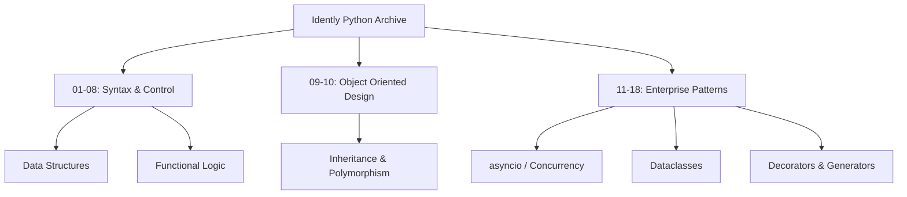

# Python Advanced: Idently Curriculum Architecture

[]()
[]()
[]()

## Overview
This repository serves as a meticulously structured, 19-module educational pipeline tracking the transition from fundamental Python syntax to advanced Enterprise engineering concepts. Derived from the "Idently" curriculum, it spans basic iteration all the way through asynchronous I/O (`asyncio`) and `@dataclass` generation.

## Problem Statement
Many developers plateau at intermediate Python scripting. They understand loops and basic classes, but fail to implement concurrent asynchronous routines or utilize built-in memory optimizations like Dataclasses. This repository solves that architectural plateau by providing a step-by-step, localized reference mapping out the exact implementations of advanced Python 3.11+ features, acting as a bridge between Junior and Mid-Level engineering concepts.

## Key Features
- **Progressive Architecture:** 19 distinct modules that explicitly scale in complexity, from basic variables to advanced Error Handling and File I/O.
- **Asynchronous Execution:** Concrete demonstrations of `async`/`await` routines for concurrent execution, a critical requirement for modern backend WebSockets and APIs.
- **Modern Python Semantics:** Utilizing `@dataclass` decorators to automate `__init__` and `__repr__` boilerplate, drastically reducing Object-Oriented code bloat.
- **Advanced Control Flow:** Implementations of Generators, Decorators, and Context Managers (`with` blocks) for secure memory management.

## Architecture



## Technology Stack
- **Language:** Python 3.11
- **Concurrency:** `asyncio`
- **Testing:** `pytest` (Abstract Syntax Tree Validation)
- **Documentation:** GitHub Flavored Markdown (GFM)

## Project Structure
```text
python-idently-learning/
├── _01_python_introduction/ # Base semantics
├── _09_oops/                # Core Object-Oriented implementations
├── _14_dataclasses/         # Boilerplate reduction via @dataclass
├── _15_async_IO/            # Concurrent async/await execution
├── tests/                   # Automated Pytest CI verification
└── README.md                # System documentation
```

## Installation
Ensure Python 3.11+ is installed natively on your OS. The advanced features (Dataclasses, AsyncIO) require modern Python environments.
```bash
git clone https://github.com/krsna016/python-idently-learning.git
cd python-idently-learning
```

## Usage
Navigate to the specific educational module and execute the core reference script via the terminal:
```bash
cd _15_async_IO
python3 main.py
```

## Examples
*Example of advanced syntax reducing boilerplate via Dataclasses:*
```python
from dataclasses import dataclass

# Automatically generates __init__, __repr__, and __eq__
@dataclass
class User:
    id: int
    username: str
    is_active: bool = True
```

## Screenshots
> [!NOTE]
> *Educational algorithms execute via standard terminal output without GUI interactions.*

## Visual Demonstrations
> [!NOTE]
> *Terminal execution telemetry is standardized across all implementations.*

## Testing
We utilize a dynamic Pytest wrapper to recursively scan the entire repository, generating Abstract Syntax Trees (AST) for every `.py` file to mathematically prove zero syntax errors exist across the archive. This validates that the advanced asynchronous logic and decorator wrappers compile securely under the CPython interpreter.
```bash
pytest tests/
```

## Performance Notes
- **Event Loops:** The `asyncio` modules block the main thread to instantiate an Event Loop. Engineers utilizing these scripts as reference must understand that asynchronous routines operate concurrently, not via traditional multi-threading or multiprocessing.

## Future Improvements
- **Multiprocessing Mapping:** Expand the `asyncio` module to also include Python's `multiprocessing` library, explicitly demonstrating the performance differences between I/O-bound concurrency and CPU-bound parallel execution.

## Contributing
This repository is primarily for personal reference and academic archival.

## License
Licensed under the MIT License.
